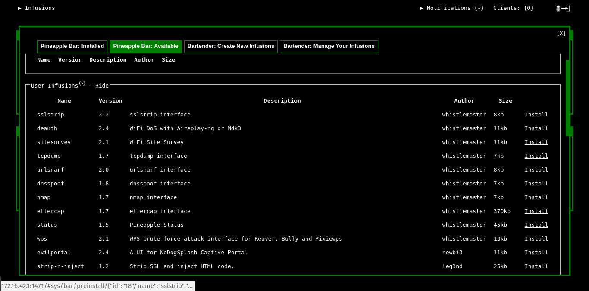
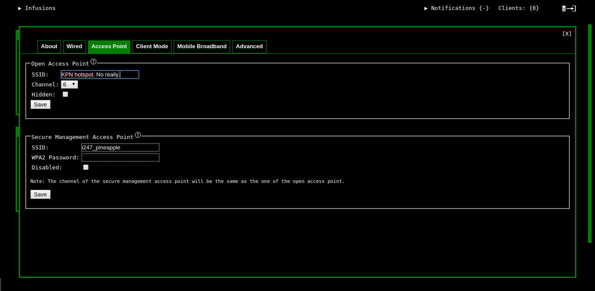
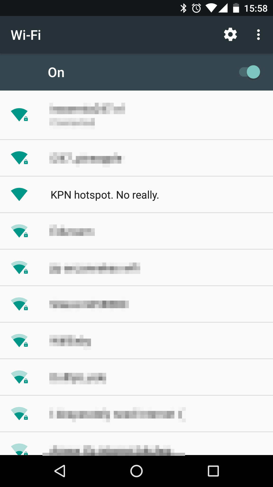
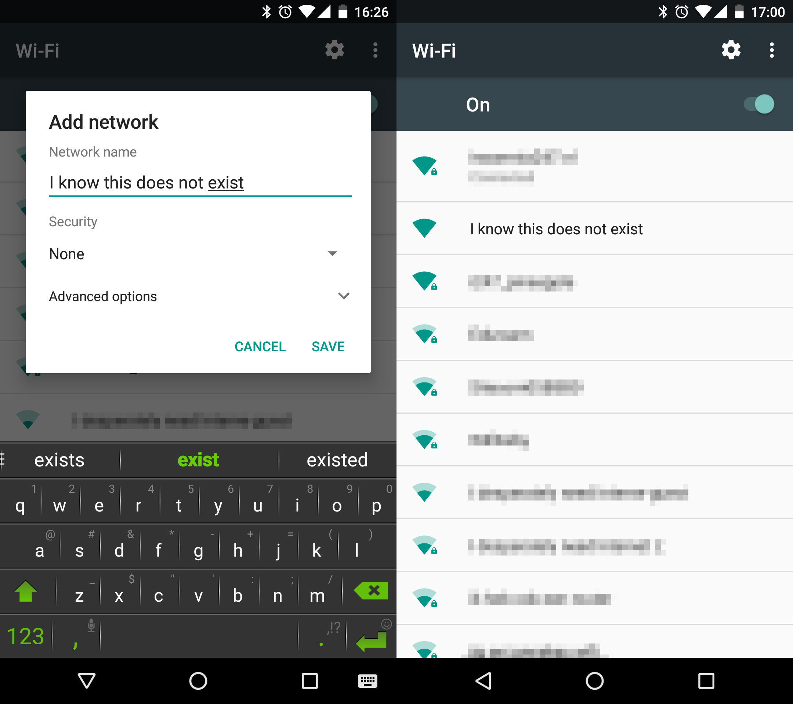
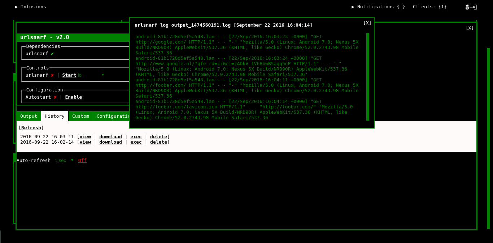

# WiFi pineapple password sniffing demo
For the purposes of this demo we will be using the WiFi Pineapple mark 5. For the mark 4 and mark 6 Tetra and Nano versions the interface will look somewhat different but the theory and principles behind this demo apply across the full range of devices. (Even the older, now unsupported pineapple revisions could still be used to accomplish many of these same things.)

## Setup details
The WiFi pineapple can be set up in many different networking configurations. For the purposes of this demo we will be using the WiFi pineapple's own ehternet port as our management interface and bridge our laptops WiFi network to provide internet connectivity to the pineapple itself.


Image: Network layout visualization for the demo network

## Getting connected to the WiFi pineapple
The first thing that must be done after powering on the WiFi pineapple is to set up our management network so we can access and control it. This is accomplished by plugging an ethernet cable into the WiFi pineapple and into our own computer. The pineapple will work as our DHCP server and assign us an IP address. When powering on the WiFi pineapple it must first boot so it will take a minute or so before you are assigned an IP address via DHCP.

Normally it will assign you an IP address in the `172.16.42.0/24` range. In the example below you can see we were assigned `172.16.42.42` as our IP address.

```
[~]$ ip a
[...]
2: enp3s0: <BROADCAST,MULTICAST,UP,LOWER_UP> mtu 1500 qdisc fq_codel state UP group default qlen 1000
    link/ether e8:11:32:6c:9e:db brd ff:ff:ff:ff:ff:ff
    inet 172.16.42.42/24 brd 172.16.42.255 scope global enp3s0
       valid_lft forever preferred_lft forever
    inet6 fe80::351e:6301:ab58:9142/64 scope link 
       valid_lft forever preferred_lft forever
[...]
```

Normally this means our WiFi pineapple's own IP address is the router address in this range, or `172.16.42.1` in this example. This is almost always the IP address it will be using. If the WiFi pineapple is **not** on the IP address expected see the troubleshooting section at the bottom of this document for possible solutions.

Now we can try to connect to the WiFi pineapple web interface by using the IP address we've determined earlier. The interface will be on port **1471** so the address will be `http://172.16.42.1:1471/`.
If you are using a brand new pineapple it will guide you through a short setup process, otherwise you can log in using **root** as the username and the password you had previously set up during the initial setup process. If you are not able to log in or don't know the password you can try a factory reset. (See the troubleshooting section at the bottom of this document.)


Image: Screenshot of the web interface

## Setting up network connection sharing
In order to allow your WiFi pineapple to connect to the internet we will need to share the internet connection from our laptop to the WiFi pineapple. The instructions differ based on the operating system you are running on your laptop. Please skip ahead to the section for your specific OS.

### Linux
For linux there is a script that will do most of the work for you. You can download it from **http://wifipineapple.com/wp5.sh**.
```
wget wifipineapple.com/wp5.sh**
```
Please note this script is specific to the MK5 version. Different versions of the pineapple have a different script available.

Next we need to check the names of our wireless and wired network interfaces. You can use the command `ip addr` or `ifconfig` to show the available interfaces and their associated IP address information. Once we have both interface names we can run the configuration script;
```
sudo bash wp5.sh
```
The script will prompt you for IP address and interface name settings. The default values are normally fine, but double check the interface names and make sure the right IP addresses are used when you are on a different subnet than the default settings for the WiFi pineapple.

### Mac OSX

### Windows

## Check connectivity
You can check if your WiFi pineapple indeed has internet connectivity now by clicking the **refresh** icon in the **WiFi Pineapple MK5** box. It will show you an error if it is unable to connect to the internet.

## Installing infusions
The WiFi pineapple functionality can be extended by what are known as **Pineapple infusions**. There are essentially plugins to give you access to more tools from the web interface. We will install a few for the purposes of this demo.

Head over to the **Pineapple Bar** section in the webinterface by clicking on the title of the box. This should bring up a new window showing a tab of already installed infusions. Click the tab marked **Pineapple Bar: Available** and then **show** on the **User infusions** to get a list of infusions we can install.


Image: Screenshot of available infusions in the pineapple bar

As an example we will now install the **opkgmanager** infusion. Simply click the **install** link next to the infusion and choose if you want to install it to the WiFi pineapples internal storage or to the SD card. Usually we will have much more space available on the SD card so we will install there. If you have not SD card in your WiFi pineapple or your SD card is full you can also install to internal storage.
Once the installation has finished it should show you a notification in the web interface.


Image: Screenshot of the notification the infusion was installed

Now when we go back to our main screen in the web interface we can see a new block named **OPKG Manager** has been added and when we click on the title we can see this infusion allows us to install and update packages on the WiFi pineapple.

We will list the any required infusions per section of the demo they apply to.

# Getting clients to connect
A WiFi access point with nobody connected isn't very interesting so it is time to get some clients to connect to our WiFi pineapple.

**Please note! You are now starting a live broadcasting attack! It advices to notify people nearby to turn WiFi off if you are not actively targeting them.**

## Basic access point name broadcasting
**Required infusions:** none

**Note:** You can skip this section if you are going to follow the **Automatic access point name broadcasting** section below.

Head over to the **Network** block in the web interface and click the **Access point** tab. Here we will see a section called **Open Access Point**, this will be the access point name we use for our clients. If you are planning to trick people into connecting to your access point by mistake you can set an SSID name like "KPN hotspot", "T-Mobile hotspot" or maybe the name of a company WiFi network you are near to. Make sure to uncheck the **hidden** box and hit **save**. It will prompt you to restart your WiFi in order to continue. At this point you should see the network pop up when you are looking for WiFi networks on a nearby device.


Image: Access point name in the interface and on phone

At this point clients can start connecting to your WiFi access point and you will be able to start further attacks.

Note; In some cases you will have to reset your WiFi pineapple the first time you after you change your network configuration. Don't forget to re-setup your internet connection sharing if you have to.

## Automatic access point name broadcasting
**Required infusions:** none

If we don't want clients to have to connect to a specific access point, or we don't know what access points they may be able to connect to we can use the **Karma** and **PineAP** modules that is built into the WiFi pineapple. This module allows the WiFi pineapple to impersonate any and all WiFi access point name, all at once. The module works by looking for the WiFi network probe requests that all WiFi client devices send out. Simply saying the WiFi client will constantly send out beacons saying "Is there an access point around with the name 'My home wifi'" or any other access point name the device has stored. The WiFi pineapple will look for these requests and simply answer "Yes! That's me!" To any and all such probe requests. This will allow the client device to automatically connect to your pineapple access point, thinking it is an access point it knows and has connected to before.

To set this up, make sure both WiFi interfaces on your WiFi pineapple are enabled. You can check the boxes for both wlan0 and wlan1 in the **Network** block.

We will be doing a very basic "catch all" attack for the access point spoofing. It is possible to filter and blacklist/whitelist specific clients and WiFi networks if required but since that is a little more work to set up we won't bother with that now.

In your web interface you will have a **PineAP** block where we will be checking all the boxes except for the **Autostart** one. When we're doing a more targeted attack we would leave some of these off.
We're now spoofing access points! To see some more status details you can open up the **PineAP** block to see the clients that have associated with our access point as well as what IP address we've assigned them, the network name the connected to and usually the host name for their system. To see the access points that are currently being spoofed, head over to the PineAP tab. Here you can also add or remove access points to the spoofing list.


Image: Screenshot of a WiFi access point name known to be spoofed

Note that some devices will not connect to your open access point if the access point they had expected was a secured access point.

### Sending deauth packets
**Required infusions:** deauth

If we want to get a client who is currently associated with another access point to connect to our access point we can try to send deauth packets for this client. This means that the client and the real access point will break their connection and will have to re-associate. Usually if we are the access point with the stronger signal the client should reconnect to us instead of the real access point.

When the deauth infusion is installed it may prompt you to install the **mdk3** infusion too if it is not installed already. Once this is done you should be able to open up the **Deauth** block in the interface.
In the deauth settings you can see a whitelist and blacklist tab at the bottom, if you want to you can target your deauth attack to specific access points here. If you do not specify any the deauth attack will be sent for all known access points. When you are ready you can click **Start** in the **Controls** section to start the deauth attack. Simply click **stop** once you are ready to stop your attack.

# Starting attacks on connected clients
## Logging HTTP requests
**Required infusions:** urlsnarf trapcookies

This attack will allow us to view what websites the clients connected to the network are requesting. Open up the **urlsnarf** block and in the **Controls** select the **eth0** interface since we are using that as our internet uplink, and hit **Start**. You should be able to see any URL that a client is requesting show up in the **Output** window at the bottom. Please note that we are not yet doing any SSL stripping attacks so we won't be able to see any HTTPS requests yet.


Image: Screenshot of urlsnarf results page

We can use the **trapcookies** infusion to do much the same thing but with HTTP cookies instead. This is very useful since cookies often will contains session keys for any website where our target is currently logged in. This often means we can use this secret token to log in to the website as the target user.

## Dumping any traffic
**Required infusions:** tcpdump

When we just want to get a complete dump of all the network traffic we can use the tcpdump infusion. This will allow us to make a packet capture we can later study at our leisure as well as import into tools like Wireshark.

When opening up the **tcpdump** block you will be presented with many of the options you may be familiar with if you have used tcpdump before. To start capturing packets you can simply select the interface you want to capture on and click **Start**. The **History** tab will show you current and previous packet captures as well as allowing you to download them in the PCAP format.

## Removing SSL from client connections
**Required infusions:** sslstrip

When a client connected to our access point uses HTTPS to connect to a site, we can't see very much of what they are doing. In order to get around this we can use sslstrip to get around this in a specific scenario; When a client connects to a website, say "google.com" they will usually not type "https://google.com" but rather expect "http://google.com" to forward them to "https://google.com/". This scenario we can take advantage of with sslstrip by catching that first plain http request and forwarding it in the pineapple. This will let us keep the connection to the client in plan HTTP rather then upgrading to HTTPS. Note that any site using HSTS will simply refuse to load when we are using sslstrip and that if the user has a bookmark or some other way of starting the connection to the HTTPS site, we are unfortunately too late to do anything about it with sslstrip. Many sites have also started to use client side redirects to send users directly to the HTTPS site without sslstrip being able to intervene.

To start sslstrip simply click into the **sslstrip** block and click **Start**. You may also want to check the **Verbose** box to get a little more information on what sslstrip is doing.

Once sslstrip is running and your target connects to a website, you will be able to log the entire browsing session as if the website does not use HTTPS at all.

Note: You can use the **strip-n-inject** infusion to do the same attack, but also inject some arbitrary html/css/javascript into the page.

## Replacing SSL in client connections
**Required infusions:** sslsplit

We can also try another approach to letting clients view the browsing session. We can intercept the initial HTTPS/SSL handshake and present our own SSL certificate instead of the real one. This means we can forward traffic between our target and the website while they are both on HTTPS, but still allow us to see the traffic. The major downside to this attack is that we won't have a signed certificate for the website the target is visiting and will be presented with a warning in the browser. However this attack can be very useful when for example some automated process or app is making a connection but not properly checking the certificate.

To perform this attack, simply click into the **sslsplit** block and hit **Start**. You should see the connections that are being intercepted in the log window at the bottom of the screen.

Note that any website using SSL certificate pinning will refuse to load if the target has visited it before. There will not even be any option to proceed past the certificate error.

## Redirecting DNS requests
**Required infusions:** dnsspoof

We can also take over DNS services for our targets. This will allow us to make their websites resolve to any address we like. For example we could redirect them to a phising page or a proxy page that will capture any information we want.

In this example we will be redirecting google.com to catfacts.co. Because that is the only thing people google anyway right?

Click into the **dnsspoof** block in the web interface and head over to the **Hosts** tab. You should see one line for "example.com" is already in the configuration. We can look up the IP address of catfacts.co by using the command `dig +short www.catfacts.co` and we should come up with an IP address. In this case I got **54.243.205.142** as the result. Now add the entry for google.com and for good measure www.google.com too:
```
54.243.205.142 google.com
54.243.205.142 www.google.com
```
Click **Save** when you are done and then **Start** in the controls. Anybody connected client who is visiting google.com should now automatically be directed to some adorable kittens instead.

# Troubleshooting
**You do NOT need to read this section unless you had problems during the setup.**
This section is for troubleshooting problems only.

## Not able to find the IP address of the WiFi pineapple
Firstly, double-check to make sure your ethernet connection is set up to receive an address over DHCP rather than being statically configured.
If for any reason your WiFi pineapple is configured differently and it does not use the 172.16.42.0/24 range you can still find out what IP address you should be using to connect to your device by looking at your internet connection settings. It should always list the IP address the WiFi pineapple has assigned to you. Supposing we have been assigned the IP address **192.168.100.99**, we can already make a guess that is probably going to be right most of the time, and that is just to try the same address with a **1** in the last position. So we would try **192.168.100.1** as our IP address for the WiFi pineapple.

In extremely rare cases when this won't work, we will need to look at network configuration and look for the subnet that the WiFi pineapple is operating in. This subnet may be displayed in two different ways, either with a suffix to the IP address that consists of a slash and some number, for example; **192.168.100.99/21**. Alternatively it may provide you a subnet mask that will look like and IP address that usually starts with **255.**. For example **255.255.248.0**. In these cases it is usually a good idea to use a tool like http://www.subnet-calculator.com/cidr.php to help you calculate the right address. For the cases where the **/21** notation is used, you enter this number in the **Mask bits** field. When you have a netmask for your IP address you can use the **CDIR netmask** dropdown to enter the netmask you have.

When you have done this the calculator should show you an IP address in the **CDIR network (Route)** field. Simply add **1** to this ip address to find your WiFi pineapple. Following our example of the **/21** range, the displayed **CDIR network (Route)** will show you **192.168.96.0**, which means our WiFi pineapples IP address should be **192.168.69.1**.
If you still cannot find the right IP address, you have the worlds oddest configuration, but you might still try to find a live IP address by using an nmap ping sweep on the subnet; `nmap -sP 192.168.100.99/21`. This will probably take a little while to complete, especially if the IP range is very big. You should get a list of live IP addresses in the IP range once the scan is complete. However if none of the above approaches worked to find the IP address of your WiFi pineapple, your guess is as good as mine as to which address in the list of live IP addresses could be your WiFi pineapple. (Hopefully there's only two and your laptop will be one of them.)

## Using alternate versions of the WiFi pineapple
You can find setup guides for most of them over at https://www.hak5.org/category/episodes/pineapple-university as well as guides on how to bride your network connection to them.

As far as changes to the web-interface goes, the tools should have the same names and basic functions except the interface will look different than it does in the examples used in this guide.

## Factory reset
If you are unable to log in or for any other reason need to perform a factory reset on the WiFi pineapple mk 5, follow the instructions below. (Please note these instructions are specific to the mk 5 and will not work on different versions of the pineapple.)

1) Power off your Pineapple.
2) Place your DIP switches in the following sequence:
```
Switch 1 - UP
Switch 2 - DOWN
Switch 3 - DOWN
Switch 4 - UP
Switch 5 - UP
```
3) Power on your Pineapple
4) Wait 5 minutes just to be safe and power off again
5) Place all of your switches back in the up position again and power on.

At this point when you reconnect to the web interface you should be presented with the first run setup process and you can set a new password.